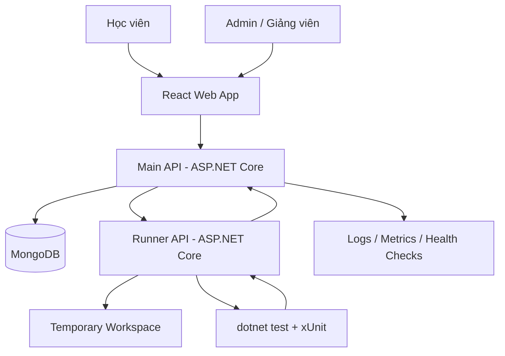
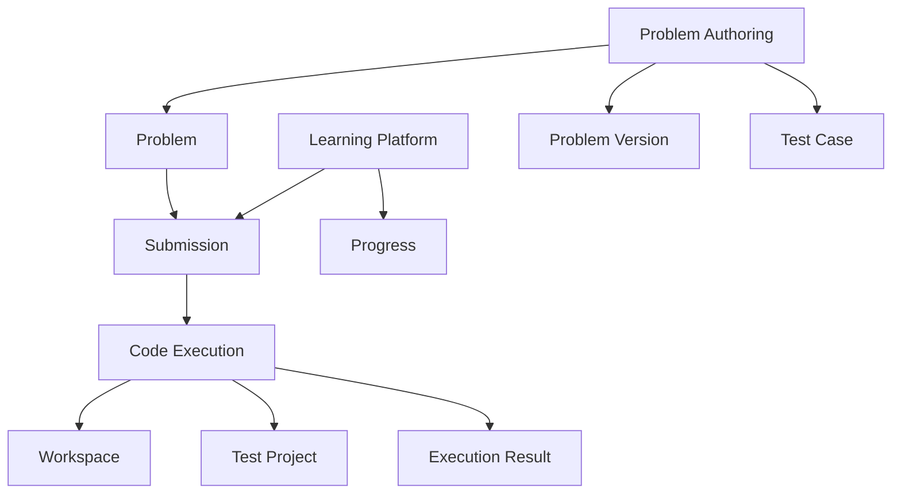
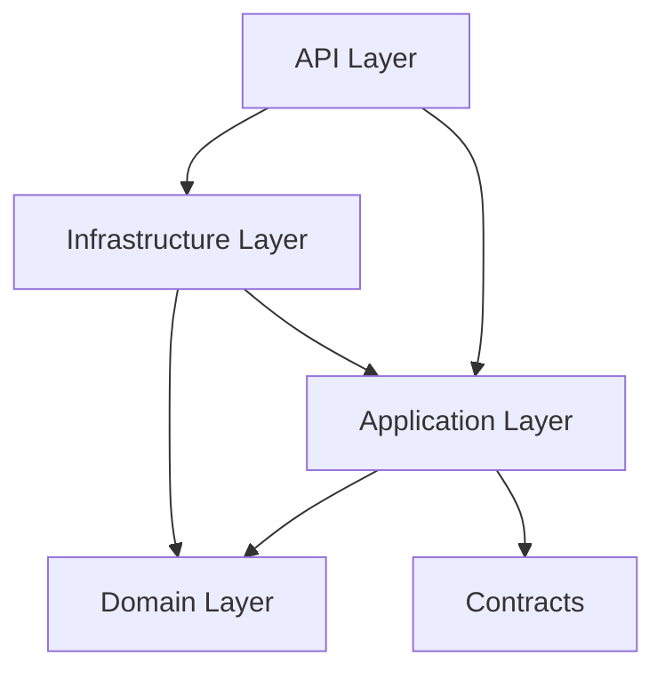
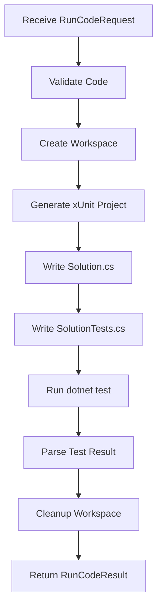

# Fastdo Code Lab - Architecture README

## 1. Mục Tiêu

Fastdo Code Lab là nền tảng luyện lập trình C# nội bộ, tương tự HackerRank ở mức tối giản. Hệ thống cho phép học viên đọc đề, code trực tiếp trên trình duyệt, chạy test case, submit bài và xem kết quả. Admin có thể tạo bài, cấu hình test case, validate bài bằng reference solution và publish bài cho học viên.

MVP ưu tiên:

- Dễ triển khai trên Windows Server.
- Backend theo Clean Architecture, không dùng CQRS.
- Database chính là MongoDB.
- Frontend dùng React.
- Runner API tách riêng để chạy code học viên.
- Có logging, health check, tracking và nền tảng mở rộng cho leaderboard/level sau này.

## 2. Kiến Trúc Tổng Thể

### 2.1 System Context




Nguyên tắc bắt buộc:

- React chỉ gọi Main API.
- React không gọi trực tiếp Runner API.
- Main API quản lý nghiệp vụ, dữ liệu và phân quyền.
- Runner API chỉ nhận yêu cầu chạy code, chạy test và trả kết quả.
- Runner API không chứa dữ liệu quan trọng, không public trực tiếp ra internet nếu không cần.

### 2.2 Bounded Context



Các boundary chính:

| Boundary | Trách nhiệm |
| --- | --- |
| Learning Platform | Học viên, submission, lịch sử làm bài, tiến độ sau này |
| Problem Authoring | Admin tạo bài, test case, validate, publish, archive |
| Code Execution | Tạo workspace, chạy code, timeout, parse kết quả |

### 2.3 Clean Architecture



Quy tắc dependency:

- `Domain` không phụ thuộc project nào.
- `Application` phụ thuộc `Domain` và `Contracts`.
- `Infrastructure` implement interface được khai báo ở `Application`.
- `API` chỉ là cổng vào, không chứa nghiệp vụ chính.

## 3. Cấu Trúc Solution Đề Xuất

```text
Fastdo.CodeLab.sln
  backend/
    CodeLab.Server/                  # Main API; one deployable project
      Api/
        Controllers/
        Middlewares/
        Extensions/
      Application/
        Problems/
        Submissions/
        Progress/
        Common/
          Results/
          Errors/
          Events/
      Domain/
        Problems/
        Submissions/
        Users/
        Common/
      Infrastructure/
        Mongo/
          Repositories/
        Runner/
        Observability/
      Contracts/
        Problems/
        Submissions/
        Runner/
        Common/

    CodeLab.Runner/                  # Internal runner; one deployable project
      Api/
        Controllers/
        Middlewares/
        Extensions/
      Application/
        Execution/
        Workspaces/
        TestProjects/
        Results/
      Infrastructure/
        Process/
        FileSystem/
        Roslyn/
        Observability/
      Contracts/
        Runner/

  tests/
    Fastdo.CodeLab.UnitTests/
    Fastdo.CodeLab.IntegrationTests/
    Fastdo.CodeLab.Runner.Tests/
```

## 4. Domain Chính

### 4.1 Core Entities

```text
CodingProblem
ProblemVersion
TestCaseDefinition
CodeSubmission
UserProgress
AuditLog
```

### 4.2 Vì Sao Cần ProblemVersion?

Khi admin sửa đề hoặc test case, nếu không version hóa thì submission cũ sẽ không biết được học viên đã pass theo bộ test nào.

Thiết kế chuẩn:

```text
Problem: Two Sum
  Version 1: bộ test ban đầu
  Version 2: bộ test đã chỉnh sửa

Submission lưu:
  ProblemId
  ProblemVersion
```

Quy tắc:

- Admin sửa bài published thì tạo version mới.
- Submission luôn gắn với version cụ thể.
- Leaderboard/progress sau này tính dựa trên submission và problem version.

## 5. Công Nghệ Sử Dụng

| Nhóm | Công nghệ | Lý do |
| --- | --- | --- |
| Frontend | React + Vite | Nhẹ, nhanh, dễ build giao diện IDE |
| Code Editor | Monaco Editor | Trải nghiệm giống VS Code |
| Backend | ASP.NET Core 8 Web API | Phù hợp stack C#, dễ deploy Windows |
| Runner | ASP.NET Core 8 Web API | Tách riêng vùng chạy code |
| Database | MongoDB Community | Free, phù hợp document model |
| Test framework | xUnit | Chuẩn .NET, dễ sinh test tự động |
| Validation | FluentValidation | Validate request rõ ràng |
| Mapping | Mapster | Nhẹ, nhanh, ít cấu hình |
| Logging | Serilog | Structured logging tốt |
| Health Check | ASP.NET Core HealthChecks | Kiểm tra API, MongoDB, Runner, workspace |
| Metrics | OpenTelemetry + Prometheus | Free, chuẩn mở |
| Dashboard | Grafana | Free, dễ quan sát metrics |
| Error/log viewer MVP | File log hoặc Seq local | Dễ triển khai ban đầu |
| Testing | xUnit + FluentAssertions + NSubstitute | Dễ viết unit/integration test |
| Deploy | IIS hoặc Windows Service | Phù hợp Windows Server |

## 6. Design Pattern Sử Dụng

| Pattern | Áp dụng | Mục đích |
| --- | --- | --- |
| Repository Pattern | MongoDB repositories | Tách Application khỏi DB |
| Adapter Pattern | RunnerClient, MongoDB, file system | Bọc external dependency |
| Strategy Pattern | Scoring, level, language runner sau này | Dễ đổi thuật toán |
| Factory Pattern | WorkspaceFactory, TestProjectFactory | Tạo workspace/test project nhất quán |
| Template Method | Execution pipeline | Chuẩn hóa các bước chạy code |
| Result Pattern | Application response | Tránh throw exception cho lỗi nghiệp vụ |
| Domain Event | SubmissionAccepted, ProblemPublished | Tách side effect khỏi use case chính |
| Options Pattern | Mongo, Runner, CodeExecution config | Quản lý cấu hình chuẩn ASP.NET Core |
| Background Queue Pattern | Runner concurrency | Giới hạn số submission chạy đồng thời |

Không dùng CQRS trong MVP. Thay vào đó dùng Application Service rõ trách nhiệm:

```text
ProblemService
AdminProblemService
SubmissionService
ProblemValidationService
UserProgressService
AuditLogService
```

## 7. Runner Architecture

### 7.1 Runner Pipeline



### 7.2 Runner Safety Rules

- Runner API chạy bằng Windows user quyền thấp.
- Không chạy bằng Administrator.
- Timeout mặc định 5 giây.
- Max concurrent executions mặc định 4.
- Workspace tạm xóa sau khi chạy.
- Chặn API nguy hiểm bằng Roslyn inspection trước, keyword block chỉ là lớp phụ.
- Runner server không chứa database backup, source code quan trọng hoặc production secret.

### 7.3 Runner Status

```text
Accepted
WrongAnswer
CompileError
RuntimeError
Timeout
BlockedApi
RunnerError
```

## 8. Monitoring, Logging, Tracking

### 8.1 Logging

Dùng Serilog structured logging.

Cần log tối thiểu:

```text
CorrelationId
UserId
ProblemId
ProblemVersion
SubmissionId
RunnerDurationMs
SubmissionStatus
ErrorCode
```

Log destination MVP:

```text
logs/api-yyyyMMdd.txt
logs/runner-yyyyMMdd.txt
```

Sau này có thể đẩy qua Seq, Loki hoặc OpenTelemetry Collector.

### 8.2 Health Checks

Endpoints:

```text
GET /health/live
GET /health/ready
GET /health
```

Main API health check:

| Check | Ý nghĩa |
| --- | --- |
| MongoDB | Kết nối DB |
| Runner API | Main API gọi được Runner |
| Disk/log path | Ghi log được |

Runner API health check:

| Check | Ý nghĩa |
| --- | --- |
| .NET SDK | Server có thể chạy `dotnet` |
| Template Path | Có template xUnit |
| Workspace Path | Có quyền ghi workspace |
| Queue | Runner còn hoạt động |

### 8.3 Metrics

Metrics nên có:

```text
submission_total
submission_accepted_total
submission_failed_total
runner_timeout_total
runner_blocked_api_total
runner_duration_ms
runner_queue_length
problem_published_total
problem_validation_failed_total
```

Stack đề xuất:

```text
OpenTelemetry
Prometheus
Grafana
```

MVP có thể triển khai Serilog + HealthChecks trước, metrics triển khai ở MVP 1.1.

### 8.4 Audit Log

Ghi lại hành động admin:

```text
CreateProblem
UpdateProblem
CreateProblemVersion
ValidateProblem
PublishProblem
ArchiveProblem
UpdateTestCase
```

Audit log tối thiểu:

```text
ActorUserId
Action
ResourceType
ResourceId
Before
After
CreatedAt
```

## 9. Database Collections

MVP:

```text
users
coding_problems
problem_versions
submissions
problem_validation_runs
audit_logs
```

Roadmap:

```text
user_progress
leaderboard_snapshots
badges
learning_paths
```

Index cần có từ đầu:

```text
coding_problems:
  slug unique
  status
  topics
  difficulty

problem_versions:
  problemId + version unique
  problemId + status

submissions:
  userId + problemId
  userId + submittedAt
  problemId + submittedAt
  status
  problemId + problemVersion

audit_logs:
  actorUserId + createdAt
  resourceType + resourceId
```

## 10. API Nhóm Chính

### 10.1 Student API

```text
GET  /api/v1/problems
GET  /api/v1/problems/{problemId}
POST /api/v1/problems/{problemId}/run-sample
POST /api/v1/problems/{problemId}/submit
GET  /api/v1/submissions
GET  /api/v1/submissions/{submissionId}
```

### 10.2 Admin API

```text
GET  /api/v1/admin/problems
POST /api/v1/admin/problems
GET  /api/v1/admin/problems/{problemId}
PUT  /api/v1/admin/problems/{problemId}
POST /api/v1/admin/problems/{problemId}/versions
POST /api/v1/admin/problems/{problemId}/validate
POST /api/v1/admin/problems/{problemId}/publish
POST /api/v1/admin/problems/{problemId}/archive
```

### 10.3 Runner API

```text
POST /api/v1/runner/csharp/run
GET  /health/live
GET  /health/ready
```

Runner API chỉ cho Main API gọi bằng API key nội bộ hoặc network allowlist.

## 11. Version Roadmap

### MVP 1.0 - Core Coding Platform

Mục tiêu: học viên làm bài C# và hệ thống chấm được bằng test case.

Chức năng:

- React Web App.
- Danh sách bài published.
- Trang IDE làm bài.
- Monaco Editor hoặc textarea nếu muốn làm nhanh.
- Run Sample bằng public tests.
- Submit bằng public + hidden tests.
- Lưu submission.
- Hiển thị Accepted/WrongAnswer/CompileError/RuntimeError/Timeout.
- Main API theo Clean Architecture.
- Runner API tách riêng.
- MongoDB repositories.
- Timeout runner 5 giây.
- Max concurrent runner = 4.
- Serilog file logs.
- Basic health check.

Chưa làm:

- Leaderboard.
- Level/XP.
- Badge.
- Import bài từ tài liệu.
- AI sinh bài.
- Docker sandbox.

### MVP 1.1 - Admin Problem Authoring

Mục tiêu: admin tự tạo và quản lý bài.

Chức năng:

- Admin problem CRUD.
- ProblemVersion.
- Structured test case editor.
- Public tests và hidden tests.
- Starter code.
- Reference solution.
- Validate problem bằng reference solution.
- Publish/Archive problem.
- Audit log cho hành động admin.
- Health check đầy đủ hơn cho Runner và MongoDB.

### MVP 1.2 - Observability & Stability

Mục tiêu: deploy ổn định trên Windows Server và dễ debug.

Chức năng:

- CorrelationId middleware.
- Structured logs đầy đủ.
- Runner execution logs.
- Health ready/live.
- Metrics bằng OpenTelemetry.
- Prometheus endpoint.
- Grafana dashboard cơ bản.
- Runner queue length metric.
- Cleanup workspace job.
- Test tải 20 học viên submit cùng lúc.

### Version 2.0 - Learning Progress & Gamification Foundation

Mục tiêu: lưu dữ liệu nền cho level, XP và dashboard học tập.

Chức năng:

- UserProgress collection.
- Tính accepted problems.
- Tính total submissions.
- Lưu attempt number.
- Lưu score/xp placeholder.
- Dashboard tiến độ học viên.
- Chuẩn bị dữ liệu cho leaderboard ngày/tuần/tháng.

### Version 2.1 - Leaderboard, Level, Badge

Mục tiêu: tăng động lực học viên.

Chức năng:

- Leaderboard ngày.
- Leaderboard tuần.
- Leaderboard tháng.
- Level theo XP.
- Badge cơ bản:
  - First Accepted.
  - 3-Day Streak.
  - 7-Day Streak.
  - First Try.
  - Topic badges.
- Sort leaderboard theo:
  - XP desc.
  - Accepted count desc.
  - Pass rate desc.
  - Runtime asc.

### Version 3.0 - Content Expansion

Mục tiêu: giúp admin có nhiều bài hơn, giảm công nhập thủ công.

Chức năng:

- Import bài từ Markdown.
- Import bài từ Word/PDF ở dạng draft.
- AI hỗ trợ sinh test case nháp.
- Admin review trước khi publish.
- Learning path theo tuần/chủ đề.
- Gợi ý bài tiếp theo cho học viên.

### Version 4.0 - Runner Hardening

Mục tiêu: tăng an toàn khi chạy code học viên.

Chức năng:

- Docker hoặc sandbox mạnh hơn nếu cần.
- Multi-language runner foundation.
- Network isolation tốt hơn.
- Memory limit thật sự.
- Runner worker pool.
- Job queue async.
- SignalR realtime execution status.

## 12. Nguyên Tắc Build

- Không để nghiệp vụ trong Controller.
- Không để MongoDB query rải rác ngoài Infrastructure.
- Không để Main API biết chi tiết Runner tạo file/chạy process.
- Không sửa trực tiếp problem published mà không tạo version mới.
- Không publish bài nếu reference solution chưa validate pass.
- Không cộng điểm/XP chính nếu học viên đã accepted bài trước đó.
- Không public Runner API trực tiếp cho frontend.
- Không chạy code học viên bằng quyền admin.
- Không lưu dữ liệu quan trọng trên Runner Server.

## 13. Thứ Tự Build Khuyến Nghị

```text
1. Tạo solution structure.
2. Tạo Contracts.
3. Tạo Domain entities: Problem, ProblemVersion, TestCase, Submission.
4. Tạo Runner API chạy hard-code xUnit project.
5. Tách Runner pipeline thành service.
6. Tạo Main API gọi Runner API.
7. Tạo MongoDB repositories.
8. Làm Student Problem List + IDE Page.
9. Làm Run Sample.
10. Làm Submit.
11. Làm Admin Problem CRUD.
12. Làm Test Case Editor.
13. Làm Validate + Publish.
14. Thêm audit log.
15. Thêm Serilog + HealthChecks.
16. Deploy Windows Server.
17. Load test 20 học viên submit cùng lúc.
```

## 14. Kết Luận

Kiến trúc chuẩn cho Fastdo Code Lab là Clean Architecture đơn giản, không CQRS, tách rõ Main API và Runner API. Điểm quan trọng nhất là version hóa bài tập, structured test case, runner an toàn, logging/health check đầy đủ và lưu submission đủ dữ liệu để mở rộng leaderboard/level sau này.

MVP không cần làm quá nhiều tính năng nâng cao, nhưng phải đặt nền đúng để không phải thiết kế lại khi hệ thống phát triển.
