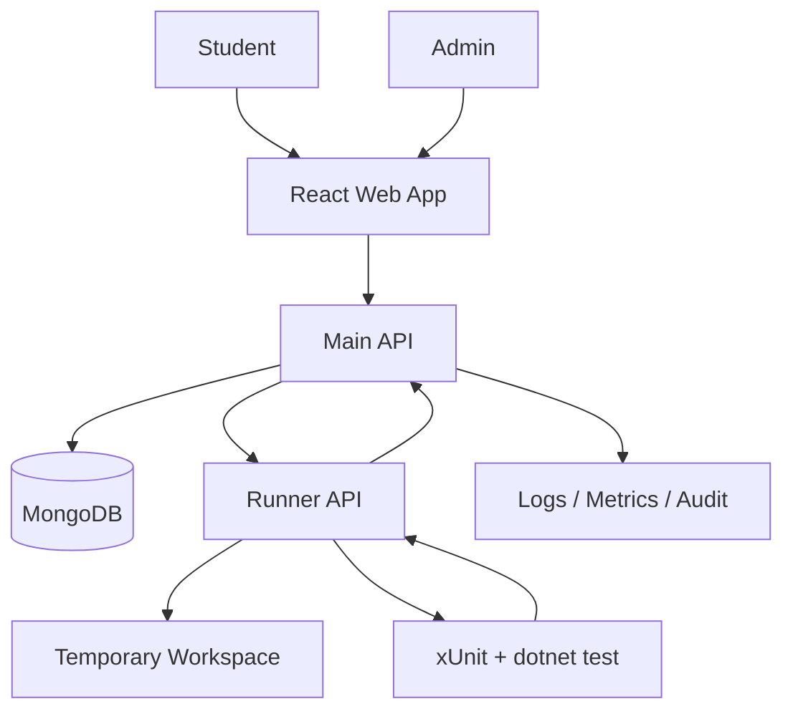

# Fastdo Code Lab - BA Specification By Version

## 0. Thông Tin Tài Liệu

| Mục | Nội dung |
| --- | --- |
| Tên dự án | Fastdo Code Lab |
| Loại hệ thống | Nền tảng luyện code C# và chấm test case nội bộ |
| Đối tượng chính | Học viên, Admin/Giảng viên |
| Backend | ASP.NET Core 8 Web API |
| Frontend | React + Vite |
| Database | MongoDB |
| Runner | Windows Server riêng, chạy `dotnet test` |
| Kiến trúc | Clean Architecture, không CQRS |
| Mục tiêu tài liệu | Làm tài liệu BA chuẩn để dev đọc được, AI coding agent hiểu được và triển khai theo từng version |

## 1. Product Vision

Fastdo Code Lab là hệ thống giúp tổ chức đào tạo C# nội bộ có thể giao bài, cho học viên code trực tiếp trên trình duyệt, chạy test case, submit bài và đo lường tiến độ học tập.

Hệ thống cần đạt 3 mục tiêu:

1. **Dạy được**: Giảng viên/Admin có thể tạo bài tập, test case và publish bài.
2. **Học được**: Học viên có thể code, chạy thử, submit và biết mình đúng/sai ở đâu.
3. **Đo được**: Hệ thống lưu lịch sử submission đủ chi tiết để sau này mở rộng leaderboard, level, XP, badge và báo cáo học tập.

## 2. Actors

| Actor | Mô tả | Quyền chính |
| --- | --- | --- |
| Student | Học viên tham gia học C# | Xem bài published, code, run sample, submit, xem lịch sử |
| Admin | Người tạo và quản lý bài tập | CRUD bài, thêm test case, validate, publish/archive |
| System | Hệ thống xử lý tự động | Chạy code, lưu submission, ghi log, health check |
| Runner Service | Service chạy code học viên | Tạo workspace, chạy xUnit, parse kết quả |

## 3. Scope Tổng Thể

### 3.1 In Scope

- React web app cho học viên và admin.
- Main API quản lý bài tập, submission, user progress.
- Runner API chạy code C# bằng xUnit.
- MongoDB lưu problem, problem version, submission, audit log.
- Admin tạo bài thủ công.
- Structured test case.
- Validate bài trước khi publish.
- Log, health check, tracking cơ bản.
- Roadmap mở rộng leaderboard, level, badge.

### 3.2 Out Of Scope Cho MVP

- Docker sandbox.
- Nhiều ngôn ngữ lập trình.
- AI tự sinh bài publish thẳng.
- Plagiarism detection.
- Realtime multiplayer.
- Payment/subscription.
- Public marketplace bài tập.

## 4. Kiến Trúc Chức Năng Tổng Quát



Nguyên tắc:

- Frontend chỉ gọi Main API.
- Main API gọi Runner API.
- Runner API không public trực tiếp cho học viên.
- Bài published không được sửa trực tiếp làm mất lịch sử; khi thay đổi test hoặc đề cần tạo `ProblemVersion`.

## 5. Data Model Tổng Quan

### 5.1 CodingProblem

```csharp
public class CodingProblem
{
    public string Id { get; set; }
    public string Slug { get; set; }
    public string Title { get; set; }
    public string Difficulty { get; set; }
    public List<string> Topics { get; set; }
    public string Status { get; set; } // Draft, Published, Archived
    public int CurrentPublishedVersion { get; set; }
    public DateTime CreatedAt { get; set; }
    public DateTime? PublishedAt { get; set; }
}
```

### 5.2 ProblemVersion

```csharp
public class ProblemVersion
{
    public string Id { get; set; }
    public string ProblemId { get; set; }
    public int Version { get; set; }
    public string DescriptionMarkdown { get; set; }
    public string StarterCode { get; set; }
    public string ReferenceSolution { get; set; }
    public List<TestCaseDefinition> PublicTests { get; set; }
    public List<TestCaseDefinition> HiddenTests { get; set; }
    public int TimeLimitMs { get; set; }
    public string ValidationStatus { get; set; } // NotValidated, Passed, Failed
    public DateTime CreatedAt { get; set; }
}
```

### 5.3 TestCaseDefinition

```csharp
public class TestCaseDefinition
{
    public string Id { get; set; }
    public string Name { get; set; }
    public string InputJson { get; set; }
    public string ExpectedOutputJson { get; set; }
    public bool IsPublic { get; set; }
    public int Score { get; set; }
    public string Explanation { get; set; }
}
```

### 5.4 CodeSubmission

```csharp
public class CodeSubmission
{
    public string Id { get; set; }
    public string UserId { get; set; }
    public string ProblemId { get; set; }
    public int ProblemVersion { get; set; }
    public string Code { get; set; }
    public string Status { get; set; } // Accepted, WrongAnswer, CompileError, RuntimeError, Timeout, BlockedApi
    public int PassedCount { get; set; }
    public int TotalCount { get; set; }
    public int RuntimeMs { get; set; }
    public int AttemptNumber { get; set; }
    public int ScoreEarned { get; set; }
    public int XpEarned { get; set; }
    public List<TestResultItem> TestResults { get; set; }
    public DateTime SubmittedAt { get; set; }
}
```

## 6. Version Roadmap

| Version | Tên | Mục tiêu |
| --- | --- | --- |
| MVP 1.0 | Core Coding Platform | Học viên code C#, run sample, submit và lưu submission |
| MVP 1.1 | Admin Problem Authoring | Admin tạo bài, thêm test, validate, publish |
| MVP 1.2 | Observability & Deployment | Log, health check, monitoring, deploy ổn định Windows Server |
| V2.0 | Learning Progress Foundation | Lưu nền dữ liệu cho progress, score, XP |
| V2.1 | Leaderboard & Level | Bảng xếp hạng, level, badge, streak |
| V3.0 | Content Expansion | Import bài từ tài liệu, AI hỗ trợ tạo draft |
| V4.0 | Runner Hardening | Sandbox mạnh hơn, async queue, multi-language foundation |

---

# Version MVP 1.0 - Core Coding Platform

## 1. Mục Tiêu

Xây nền tảng tối thiểu để học viên có thể:

- Xem danh sách bài C# đã published.
- Mở một bài cụ thể.
- Code trong trình duyệt.
- Chạy public test bằng `Run Sample`.
- Submit để chạy public + hidden test.
- Xem kết quả chấm bài.
- Lưu lịch sử submission.

## 2. In Scope

- Student problem list.
- Student problem detail/IDE page.
- Run Sample.
- Submit.
- Runner API chạy `dotnet test`.
- MongoDB lưu problem, problem version và submission.
- Timeout runner 5 giây.
- Giới hạn runner concurrency = 4.
- Basic Serilog file logging.
- Basic health check.

## 3. Out Of Scope

- Admin tạo bài qua UI.
- Leaderboard/level/XP.
- Import bài từ tài liệu.
- AI sinh bài.
- Docker sandbox.
- Multi-language.

## 4. User Stories

### US-MVP1-01 - Student xem danh sách bài

**As a** Student  
**I want** xem danh sách bài đã được publish  
**So that** tôi chọn bài để luyện tập.

Acceptance Criteria:

- Chỉ hiển thị bài có `Status = Published`.
- Hiển thị title, difficulty, topics và trạng thái đã làm nếu có.
- Nếu không có bài, hiển thị empty state rõ ràng.

### US-MVP1-02 - Student mở bài và code

**As a** Student  
**I want** mở bài và viết code C#  
**So that** tôi giải bài trực tiếp trong hệ thống.

Acceptance Criteria:

- Hiển thị description markdown.
- Hiển thị starter code.
- Có editor nhập code.
- Có nút `Run Sample`.
- Có nút `Submit`.
- Có vùng console/result.

### US-MVP1-03 - Student chạy sample test

**As a** Student  
**I want** chạy sample test  
**So that** tôi kiểm tra nhanh code trước khi submit.

Acceptance Criteria:

- Hệ thống chỉ chạy public tests.
- Không lưu kết quả như một submission chính thức, hoặc lưu với type `RunSample` nếu cần audit.
- Hiển thị pass/fail từng public test.
- Nếu compile error, hiển thị lỗi compile.
- Nếu timeout, hiển thị timeout.

### US-MVP1-04 - Student submit bài

**As a** Student  
**I want** submit bài  
**So that** hệ thống chấm toàn bộ public + hidden tests.

Acceptance Criteria:

- Hệ thống chạy public + hidden tests.
- Lưu submission vào MongoDB.
- Submission lưu `ProblemId`, `ProblemVersion`, `UserId`, `Status`, `RuntimeMs`, `AttemptNumber`, `SubmittedAt`.
- Trả kết quả tổng quan: accepted/wrong answer/compile error/runtime error/timeout.
- Hidden test không lộ input chi tiết nếu cấu hình ẩn.

## 5. Business Rules

| Mã | Rule |
| --- | --- |
| BR-MVP1-01 | Student chỉ thấy bài Published. |
| BR-MVP1-02 | Submit luôn gắn với `ProblemVersion` hiện tại tại thời điểm submit. |
| BR-MVP1-03 | Run Sample chỉ chạy public tests. |
| BR-MVP1-04 | Submit chạy cả public và hidden tests. |
| BR-MVP1-05 | Timeout mặc định là 5000ms. |
| BR-MVP1-06 | Runner chỉ chạy tối đa 4 execution cùng lúc. |
| BR-MVP1-07 | Nếu code bị chặn do API nguy hiểm, status là `BlockedApi`. |

## 6. Main APIs

```text
GET  /api/v1/problems
GET  /api/v1/problems/{problemId}
POST /api/v1/problems/{problemId}/run-sample
POST /api/v1/problems/{problemId}/submit
GET  /api/v1/submissions
GET  /api/v1/submissions/{submissionId}
```

## 7. Test Scenarios

| Scenario | Input | Expected |
| --- | --- | --- |
| Accepted | Code đúng | Status `Accepted`, passed = total |
| Wrong Answer | Code sai logic | Status `WrongAnswer`, có failed test |
| Compile Error | Code sai syntax | Status `CompileError`, có compile message |
| Runtime Error | Code throw exception | Status `RuntimeError` |
| Timeout | Code vòng lặp vô hạn | Status `Timeout`, process bị kill |
| Blocked API | Code dùng `System.IO` | Status `BlockedApi` |

## 8. AI Coding Prompt

```text
Ticket: MVP1-Core-Coding-Platform
Type: Feature
Mode: implement
Target: both

--- Context ---
Build the first MVP of Fastdo Code Lab, a C# coding practice platform.
Use React + ASP.NET Core 8 + MongoDB.
The backend must follow Clean Architecture and must not use CQRS.

--- Request ---
Implement the student flow:
1. List published problems.
2. Open problem detail.
3. Show starter code.
4. Run public tests via Run Sample.
5. Submit code against public + hidden tests.
6. Save submissions.

--- Business rules ---
- Student only sees Published problems.
- Every submission must store ProblemId and ProblemVersion.
- Run Sample uses public tests only.
- Submit uses public + hidden tests.
- Runner timeout is 5000ms.
- Runner max concurrency is 4.
- Runner API must be called only by Main API.

--- Implementation workflow ---
1. Create solution structure.
2. Implement Domain entities.
3. Implement Contracts.
4. Implement Runner API with hard-coded xUnit execution first.
5. Implement Main API calling Runner API.
6. Implement MongoDB repositories.
7. Implement React problem list and IDE page.
8. Add logs and basic health checks.

--- Test scenarios ---
- Accepted.
- WrongAnswer.
- CompileError.
- RuntimeError.
- Timeout.
- BlockedApi.

--- Acceptance criteria ---
- Student can open a published problem and submit C# code.
- Submission is persisted in MongoDB.
- Runner returns correct status.
- No business logic is placed inside controllers.
- MongoDB access is isolated in Infrastructure.
- Runner details are hidden behind RunnerClient.

--- Completion report ---
Report changed files, key decisions, test result, known risks and unfinished items.
```

---

# Version MVP 1.1 - Admin Problem Authoring

## 1. Mục Tiêu

Cho phép Admin/Giảng viên tự tạo bài tập, cấu hình test case, validate bằng reference solution và publish bài cho học viên.

## 2. In Scope

- Admin problem list.
- Create/edit/archive problem.
- Create new problem version.
- Edit description markdown.
- Edit starter code.
- Edit reference solution.
- Add/edit/delete public tests.
- Add/edit/delete hidden tests.
- Validate problem version.
- Publish problem version.
- Audit log admin actions.

## 3. Out Of Scope

- AI sinh bài tự động.
- Import Word/PDF.
- Bulk upload bài tập.
- Role/permission phức tạp.

## 4. User Stories

### US-MVP11-01 - Admin tạo bài draft

**As an** Admin  
**I want** tạo bài ở trạng thái Draft  
**So that** tôi chuẩn bị nội dung trước khi publish.

Acceptance Criteria:

- Admin nhập title, slug, difficulty, topics.
- Bài mới có status `Draft`.
- Slug không được trùng.
- Draft chưa hiển thị cho học viên.

### US-MVP11-02 - Admin thêm test case

**As an** Admin  
**I want** thêm public và hidden test cases  
**So that** hệ thống có dữ liệu để chấm bài.

Acceptance Criteria:

- Test case có name, input JSON, expected output JSON, score, isPublic.
- Public test hiển thị khi run sample.
- Hidden test chỉ dùng khi submit.
- Input JSON phải validate được.
- Expected output JSON phải validate được.

### US-MVP11-03 - Admin validate bài

**As an** Admin  
**I want** chạy reference solution qua toàn bộ test  
**So that** đảm bảo bài và test case đúng trước khi publish.

Acceptance Criteria:

- Validate chạy public + hidden tests.
- Nếu reference solution fail, không cho publish.
- Hiển thị test nào fail.
- Nếu tất cả pass, version có `ValidationStatus = Passed`.

### US-MVP11-04 - Admin publish bài

**As an** Admin  
**I want** publish bài đã validate pass  
**So that** học viên có thể làm bài.

Acceptance Criteria:

- Chỉ version validate pass mới được publish.
- Publish cập nhật `CurrentPublishedVersion`.
- Học viên chỉ thấy version đã publish.
- Ghi audit log publish.

## 5. Business Rules

| Mã | Rule |
| --- | --- |
| BR-MVP11-01 | Draft không hiển thị cho Student. |
| BR-MVP11-02 | Published problem không sửa trực tiếp test case; phải tạo version mới. |
| BR-MVP11-03 | Không publish nếu chưa validate pass. |
| BR-MVP11-04 | Mỗi problem chỉ có một current published version. |
| BR-MVP11-05 | Mọi hành động create/update/publish/archive phải ghi audit log. |

## 6. Main APIs

```text
GET  /api/v1/admin/problems
POST /api/v1/admin/problems
GET  /api/v1/admin/problems/{problemId}
PUT  /api/v1/admin/problems/{problemId}
POST /api/v1/admin/problems/{problemId}/versions
PUT  /api/v1/admin/problems/{problemId}/versions/{version}
POST /api/v1/admin/problems/{problemId}/versions/{version}/validate
POST /api/v1/admin/problems/{problemId}/versions/{version}/publish
POST /api/v1/admin/problems/{problemId}/archive
```

## 7. Test Scenarios

| Scenario | Expected |
| --- | --- |
| Tạo bài slug trùng | Trả validation error |
| Publish khi chưa validate | Không cho publish |
| Validate reference solution pass | ValidationStatus = Passed |
| Validate reference solution fail | ValidationStatus = Failed, có lỗi cụ thể |
| Sửa bài đã published | Tạo version mới |
| Archive bài | Student không còn thấy bài |

## 8. AI Coding Prompt

```text
Ticket: MVP11-Admin-Problem-Authoring
Type: Feature
Mode: implement
Target: both

--- Context ---
Extend Fastdo Code Lab with admin problem authoring.
The system already has student problem list, submit flow, Runner API and MongoDB.

--- Request ---
Implement admin features:
1. Create/edit/archive problem.
2. Create and edit problem versions.
3. Add public and hidden structured test cases.
4. Add starter code and reference solution.
5. Validate reference solution against all tests.
6. Publish only validated problem version.
7. Write audit logs for admin actions.

--- Business rules ---
- Draft problems are invisible to students.
- Published versions must not be modified directly.
- Editing a published problem must create a new version.
- Only validation-passed versions can be published.
- Every admin mutation must write audit log.

--- Acceptance criteria ---
- Admin can create a problem draft.
- Admin can add structured test cases.
- Admin can validate reference solution.
- Admin can publish a validated version.
- Student sees only published problems.
- Audit log records create/update/validate/publish/archive.

--- Completion report ---
Report changed files, test result, known risks and migration/index changes.
```

---

# Version MVP 1.2 - Observability & Deployment

## 1. Mục Tiêu

Đưa hệ thống vào trạng thái có thể deploy ổn định trên Windows Server, dễ debug khi học viên submit lỗi.

## 2. In Scope

- Serilog structured logs.
- CorrelationId middleware.
- Health check live/ready.
- Runner health check.
- MongoDB health check.
- Workspace write permission check.
- .NET SDK availability check.
- Metrics foundation.
- Deployment checklist cho Windows Server/IIS.

## 3. User Stories

### US-MVP12-01 - Dev theo dõi một submission từ API đến Runner

**As a** Developer  
**I want** mỗi submission có CorrelationId  
**So that** tôi trace được request qua Main API và Runner API.

Acceptance Criteria:

- Mỗi request có CorrelationId.
- Log Main API và Runner API cùng ghi CorrelationId.
- Submission log có UserId, ProblemId, ProblemVersion, SubmissionId, Status.

### US-MVP12-02 - Admin/Dev kiểm tra health hệ thống

**As a** Developer  
**I want** có health endpoint  
**So that** tôi biết API, DB, Runner có sẵn sàng không.

Acceptance Criteria:

- `/health/live` trả OK nếu process sống.
- `/health/ready` kiểm tra MongoDB, Runner API, workspace path.
- Runner `/health/ready` kiểm tra .NET SDK và template path.

## 4. Health Check Matrix

| Service | Check | Expected |
| --- | --- | --- |
| Main API | MongoDB | Connected |
| Main API | Runner API | Reachable |
| Main API | Log path | Writable |
| Runner API | dotnet SDK | Available |
| Runner API | Template path | Exists |
| Runner API | Workspace path | Writable |
| Runner API | Queue | Active |

## 5. Metrics

```text
submission_total
submission_accepted_total
submission_failed_total
runner_timeout_total
runner_blocked_api_total
runner_duration_ms
runner_queue_length
problem_published_total
problem_validation_failed_total
```

## 6. AI Coding Prompt

```text
Ticket: MVP12-Observability-Deployment
Type: Feature
Mode: implement
Target: server

--- Context ---
Fastdo Code Lab needs production readiness for Windows Server deployment.

--- Request ---
Add structured logging, CorrelationId, health checks and basic metrics.

--- Business rules ---
- Every request must have CorrelationId.
- Main API and Runner API logs must include CorrelationId.
- Readiness health check must validate external dependencies.
- Do not log full student code by default.
- Do not log secrets.

--- Acceptance criteria ---
- /health/live and /health/ready exist.
- MongoDB health check works.
- Runner health check works.
- Runner validates dotnet SDK, template path and workspace path.
- Logs include SubmissionId, UserId, ProblemId, ProblemVersion and Status.
- System can be diagnosed when a submission fails.

--- Completion report ---
Report health check endpoints, log fields, metrics added and deployment notes.
```

---

# Version 2.0 - Learning Progress Foundation

## 1. Mục Tiêu

Chuẩn bị nền dữ liệu cho progress, score, XP và dashboard học tập mà chưa cần làm leaderboard đầy đủ.

## 2. In Scope

- UserProgress collection.
- Accepted problem count.
- Total submission count.
- Attempt number.
- ScoreEarned placeholder.
- XpEarned placeholder.
- My Progress basic page.

## 3. Business Rules

| Mã | Rule |
| --- | --- |
| BR-V20-01 | Accepted lần đầu mới tính là hoàn thành bài. |
| BR-V20-02 | Submit lại bài đã accepted vẫn lưu submission nhưng không cộng completion count. |
| BR-V20-03 | UserProgress có thể rebuild từ submissions. |
| BR-V20-04 | Progress calculation phải idempotent. |

## 4. AI Coding Prompt

```text
Ticket: V20-Learning-Progress-Foundation
Type: Feature
Mode: implement
Target: both

--- Request ---
Add UserProgress foundation for future XP, level and leaderboard.

--- Business rules ---
- First Accepted per problem counts as completed.
- Re-submission after accepted does not increase completed count.
- Progress must be rebuildable from submissions.
- Calculations must be idempotent.

--- Acceptance criteria ---
- UserProgress is updated after accepted submission.
- UserProgress can be rebuilt from existing submissions.
- Student can view basic progress.
- Existing submission flow does not break.
```

---

# Version 2.1 - Leaderboard, Level, Badge

## 1. Mục Tiêu

Tăng động lực học tập bằng bảng xếp hạng, level, XP, badge và streak.

## 2. In Scope

- Leaderboard ngày/tuần/tháng.
- XP calculation.
- Level thresholds.
- Badge cơ bản.
- Streak học tập.
- Leaderboard page.

## 3. Ranking Criteria

Thứ tự xếp hạng:

1. XP earned desc.
2. Accepted count desc.
3. Pass rate desc.
4. Total runtime asc.

## 4. Level Thresholds

| Level | Tên | XP |
| --- | --- | --- |
| 1 | Nhập môn | 0 |
| 2 | Làm quen | 50 |
| 3 | Giải bài cơ bản | 120 |
| 4 | Tư duy thuật toán | 250 |
| 5 | Vượt thử thách | 450 |
| 6 | Thành thạo | 700 |
| 7 | Nâng cao | 1000 |
| 8 | Chuyên sâu | 1400 |
| 9 | Bậc thầy | 1900 |
| 10 | Mentor | 2500 |

## 5. AI Coding Prompt

```text
Ticket: V21-Leaderboard-Level-Badge
Type: Feature
Mode: implement
Target: both

--- Request ---
Add leaderboard, XP, level, badge and streak.

--- Business rules ---
- Only first accepted submission grants main XP.
- Leaderboard supports daily, weekly, monthly.
- Ranking sort: XP desc, accepted count desc, pass rate desc, runtime asc.
- XP and level must be rebuildable from submissions.

--- Acceptance criteria ---
- Student can view leaderboard.
- Student can view current level and XP.
- Badges are granted once.
- Rebuild produces the same result.
```

---

# Version 3.0 - Content Expansion

## 1. Mục Tiêu

Giúp Admin có thêm bài nhanh hơn thông qua import tài liệu và AI hỗ trợ tạo draft.

## 2. In Scope

- Import Markdown thành draft problem.
- Import Word/PDF thành draft problem nếu khả thi.
- AI hỗ trợ gợi ý test case.
- Admin review trước khi publish.
- Learning path theo topic/tuần.

## 3. Business Rules

| Mã | Rule |
| --- | --- |
| BR-V30-01 | AI/import chỉ tạo Draft, không publish tự động. |
| BR-V30-02 | Admin phải review và validate trước khi publish. |
| BR-V30-03 | Generated tests phải được reference solution validate pass. |

## 4. AI Coding Prompt

```text
Ticket: V30-Content-Expansion
Type: Feature
Mode: implement
Target: both

--- Request ---
Add content import and AI-assisted draft creation.

--- Business rules ---
- Imported/AI-generated content must always be Draft.
- Admin must review before publish.
- Problem validation is mandatory before publish.

--- Acceptance criteria ---
- Admin can import markdown into draft.
- Admin can review generated draft.
- Admin can edit generated test cases.
- Draft cannot be published until validation passes.
```

---

# Version 4.0 - Runner Hardening

## 1. Mục Tiêu

Tăng độ an toàn và khả năng mở rộng của Runner.

## 2. In Scope

- Async job queue.
- SignalR realtime execution status.
- Stronger sandbox option.
- Docker optional.
- Memory limit thật sự nếu có sandbox.
- Multi-language foundation.
- Runner worker pool.

## 3. Business Rules

| Mã | Rule |
| --- | --- |
| BR-V40-01 | Runner implementation có thể thay đổi nhưng Main API contract không đổi. |
| BR-V40-02 | Mỗi execution phải có timeout và cleanup. |
| BR-V40-03 | Sandbox failure không được làm crash Main API. |

## 4. AI Coding Prompt

```text
Ticket: V40-Runner-Hardening
Type: Refactor
Mode: implement
Target: server

--- Request ---
Harden Runner architecture with async queue, stronger isolation and future multi-language support.

--- Business rules ---
- Keep existing Runner contract stable.
- Main API must not know runner implementation details.
- Every execution must timeout and cleanup workspace.
- Runner failure must return controlled error.

--- Acceptance criteria ---
- Existing C# submissions still work.
- Runner can process jobs asynchronously.
- Frontend can receive execution status.
- Architecture supports adding another language later.
```

---

# 7. Tổng Hợp Acceptance Criteria Toàn Dự Án

## Functional

- Student làm được bài C# từ đầu đến cuối.
- Admin tạo và publish được bài.
- Runner chấm đúng các trạng thái chính.
- Submission được lưu đầy đủ.
- Problem version bảo toàn lịch sử.

## Non-Functional

- API chính phản hồi trong khoảng 200-500ms với tác vụ không chạy code.
- Trang chính tải dưới 2 giây trong điều kiện bình thường.
- Runner timeout mặc định 5 giây.
- Hệ thống chịu được 20 học viên sử dụng cùng lúc.
- Runner max concurrency mặc định 4.
- Có log đủ để debug một submission.
- Có health check cho Main API và Runner API.
- Không chạy code học viên bằng quyền admin.

## Security

- Runner API không public trực tiếp cho frontend.
- Runner API được gọi bởi Main API qua API key nội bộ hoặc network allowlist.
- Không log full source code học viên mặc định.
- Không lưu secret trên Runner Server.
- Chặn API nguy hiểm trước khi chạy code.

## Maintainability

- Không đặt business logic trong Controller.
- Không truy cập MongoDB ngoài Infrastructure.
- Không để Runner implementation leak vào Main API.
- Không dùng CQRS trong MVP.
- Application Service đặt tên theo nghiệp vụ.
- Domain rule quan trọng nằm trong Domain/Application, không nằm ở UI.

## 8. Definition Of Done

Một version chỉ được xem là hoàn thành khi:

- Code build pass.
- Unit test pass với domain/application logic chính.
- Integration test pass với API/repository quan trọng.
- Runner test pass cho Accepted/WrongAnswer/CompileError/RuntimeError/Timeout.
- Health check hoạt động.
- Log có CorrelationId.
- Có completion report: changed files, decisions, tests, risks.
- Không còn TODO ảnh hưởng business rule trong scope.

## 9. Ghi Chú Cho AI Coding Agent

Khi triển khai bất kỳ ticket nào trong dự án này:

1. Đọc tài liệu architecture trước.
2. Không tự ý đổi kiến trúc sang CQRS.
3. Không đưa business logic vào Controller.
4. Không để frontend gọi Runner API trực tiếp.
5. Không sửa published problem mà không xét version.
6. Không bỏ qua health check/logging khi đụng tới Runner.
7. Nếu có ambiguity ảnh hưởng data model, API contract hoặc business rule, phải hỏi lại trước khi code.
